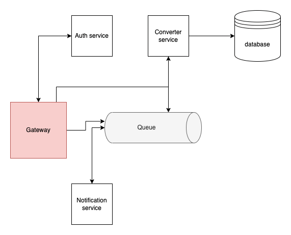

# Micropy
---
### Overview
Mp4 to Mp3 converter using microservices architecture.

### System Architecture
<div align="center">
    
    <p align="center"><i>fig. 1 Overview of system</i></p>
</div>

**Working**
1.
**Tech Stack**
- _Programming languages: `Python`.
- _Development: `Flask`, `Docker`, `Kubernetes`, `Rabbitmq`, `Mysql`.

### **System components**

| Component             | Description                                               |
| --------------------- | --------------------------------------------------------- |
| `Auth service`        | Handle authentication and validation of user using jwt    |
| `Converter service`   | Convert Mp4 file to Mp3 file and store them in MongoDB    |
| `Gateway service`     | Handle all client request and route them to appropriate   |
| `Notification service`| After conversion sends notification to user via mail      |
| `RabbitMq server`     | Message queue used to store the conversion task           |

### Running Guide

**Prerequisits**
- [Install Python](python.org/downloads/)
- [Install Docker](https://docs.docker.com/engine/install/)
- [Install Minikube](https://minikube.sigs.k8s.io/docs/start/)
- [Install Mysql](https://dev.mysql.com/doc/mysql-installation-excerpt/5.7/en/)

**To view the docker container in kubernetes**

>run this command in terminal - `k9s`

1. Enable ingress plugin for minikube.

```bash
minikube addon enable ingress
```

2. Map the loopback address /etc/hosts.

> 127.0.0.1 kubernetes.docker.internal

3. Run minikube tunnel.

```bash
minikube tunnel
```

4. Add image name in *-deploy.yaml files and email credentials in secret.yaml file of notification serivce.

5. Build docker image in every service and host in remote repository (Docker Hub).

```bash
Docker build .
Docker tag container_id:latest
Docker push
```

6. Run the service by pulling the image and hosting on kubernetes by running this command in manifest folder of each service.

```bash
kubectl apply -f ./
```

### Limitation

Doesn't support multiple file uploads.